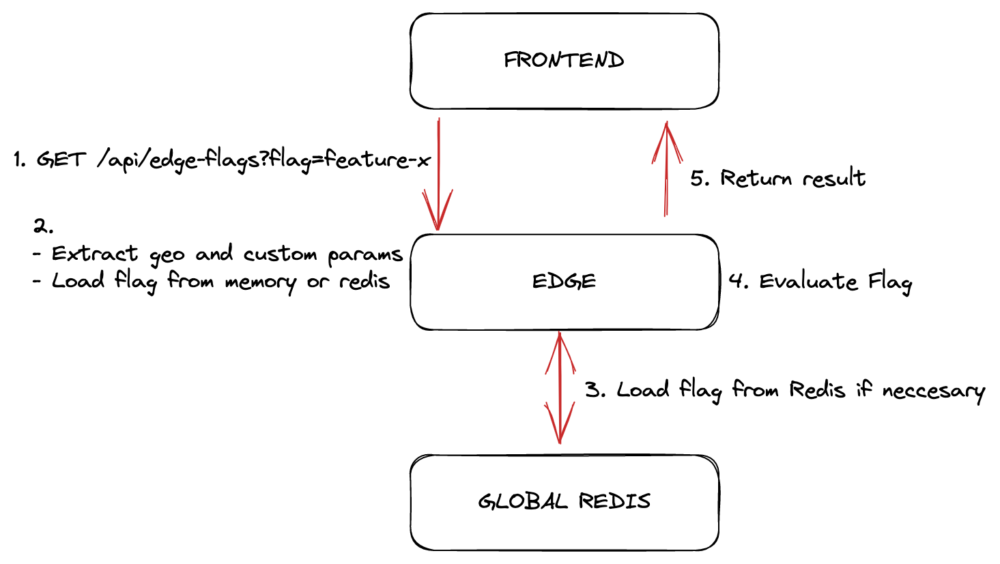

<div align="center">
    <h1 align="center">Edge Flags</h1>
    <h5>Feature Flags for the Edge</h5>
</div>

<div align="center">
  <a href="https://edge-flags.vercel.app/">edge-flags.vercel.app</a>
</div>
<br/>


Edge Flags is a low latency feature flagging solution running at the edge and storing data in a global Redis database. It is designed to be used with [Next.js](https://nextjs.org) and [Vercel](https://vercel.com) but we will soon roll out support for other popular frameworks and platforms. Let us know what you are looking for!


## Features

- **Global Low latency:** Flags are stored in a global Redis database and are evaluated at the edge.
- **Environments:** Flags have different environments to support your deployment process: `production`, `preview`, `development`
- **Flexible:** Flags support geo targeting, percentage based rollouts and custom attributes
- **Manage:** Flags can be created and managed using the SDK or our [console](https://console.upstash.com/edge-flags).
- **Free:** Edge Flags is free to use. You only pay for the Redis database.
- **Cache:** Flags can be cached for a short period of time to reduce the required requests to redis, making it cheaper to use.

<br/>

## Architecture



## Quickstart

1. Go to
   [console.upstash.com/edge-flags](https://console.upstash.com/edge-flags) and
   create a flag.

   See our [docs](https://docs.upstash.com/redis/sdks/edge-flags/overview) for more information.

2. Install `@upstash/edge-flags` in your project

```bash
npm install @upstash/edge-flags
```

3. Create an edge function in your project

```ts
// /api/edge-flags.ts
import { createEdgeHandler } from "@upstash/edge-flags";

export default createEdgeHandler({
  cacheMaxAge: 60, // cache for 60 seconds
  redisUrl: process.env.UPSTASH_REDIS_REST_URL!, // omit to load from env automatically
  redisToken: process.env.UPSTASH_REDIS_REST_TOKEN!, // omit to load from env automatically
});

/**
 * Edge flags only works in edge functions, it will break if you do not set the runtime
 */
export const config = {
  runtime: "experimental-edge",
};
```
4. Query the flag in your frontend

```tsx
// /app/index.tsx
import { useFlag } from "@upstash/edge-flags";
export default function Example() {

  const { isEnabled, isLoading, error } = useFlag("flag-name");
  
  if (error) return <div>Error: {error}</div>;
  if (isLoading) return <div>Loading...</div>;
  
  return <div>Is my feature enabled: {isEnabled}</div>;
}
```

## Custom attributes

`useFlag` accepts an optional object that can be used to pass custom attributes
to be evaluated in the flag rules.

```tsx
const attributes = {
  userId: "chronark",
  role: "admin",
};

useFlag("flag-name", attributes);
```


## Development

This monorepo is managed by turborepo and uses `pnpm` for dependency management.

#### Install dependencies

```bash
pnpm install
```

#### Build

```bash
pnpm build
```


## Database Schema

All configuration is stored in Redis `String` data types. Each flag is
accessible through a key like

```
STRING
edge-flags:{TENANT}:flags:{FLAG_NAME}:{ENVIRONMENT}
```

In addition to the flags, there will be a single set that contains all the flag IDs. We can not guarantee the database is only used for edge-flags so we need to keep track of the flags we have created instead of using a potentially expensive
`SCAN` operation.

```
SET 
edge-flags:{TENANT}:flags
```

- `TENANT` is currently unused (set as `default`) but reserved for future use.
  ie for managing multiple projects int a single database
- `FLAG_NAME` is the unique identifier for the flag
- `ENVIRONMENT` is the environment the flag is targeting. ie `production`,
  `preview`, `development`

### Packages

- **/packages/sdk:** The SDK to be imported into your project
- **/examples/nextjs:** An example Next.js app using the SDK

## Authors

This project was originally created by

- [@ademilter](https://twitter.com/ademilter)
- [@chronark_](https://twitter.com/chronark_)
- [@enesakar](https://twitter.com/enesakar)
