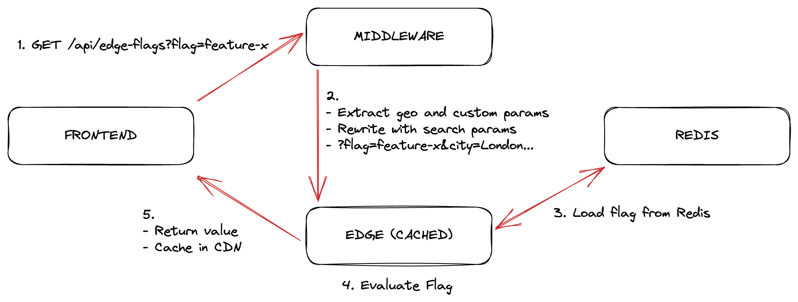

<div align="center">
    <h1 align="center">Edge Flags</h1>
    <h5>Low latency feature flags at the edge</h5>
</div>

<div align="center">
  <a href="https://edge-flags.vercel.app/">edge-flags.vercel.app</a>
</div>
<br/>


TODO: Add description

## Powered by

- [Upstash Global Redis Database](https://docs.upstash.com/redis/features/globaldatabase)
- [Next.js](https://nextjs.org) 
- [Vercel](https://vercel.com)

<br/>




## Development

This monorepo is managed by turborepo and uses `pnpm` for dependency management.

#### Install dependencies

```bash
pnpm install
```

#### Build
  
```bash
pnpm build
```

## Database Schema

All configuration is stored in Redis `String` data types. Each flag is accessible through a key like

```
STRING
edge-flags:{TENANT}:flags:{FLAG_ID}:{ENVIRONMENT}
```
In addition to the flags, there will be a single set that contains all the flag IDs.
We can not guarantee the database is only used for edge-flags so we need to keep track of the flags we have created instead of using a potentially expensive `SCAN` operation.
```
SET 
edge-flags:{TENANT}:flags
```

- `TENANT` is currently unused (set as `default`) but reserved for future use. ie for managing multiple projects int a single database
- `FLAG_ID` is the unique identifier for the flag
- `ENVIRONMENT` is the environment the flag is targeting. ie `production`, `preview`, `development`

### Packages

- **/packages/sdk:** The SDK to be imported into your project
- **/packages/web:** The management interface you can selfhost [Link](https://edge-flags.vercel.app)
- **/examples/nextjs:** TODO: An example Next.js app using the SDK
- **/examples/nextjs12:** TODO: Using the SDK with Next.js 12 

## Authors

This project was originally created by
- [@ademilter](https://twitter.com/ademilter)
- [@chronarkdotdev](https://twitter.com/chronarkdotdev)
- [@enesakar](https://twitter.com/enesakar)


